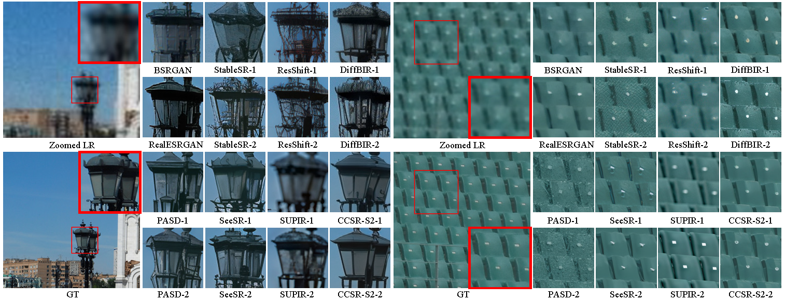
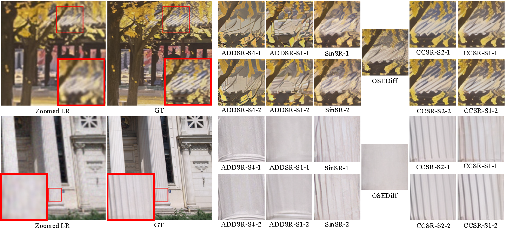
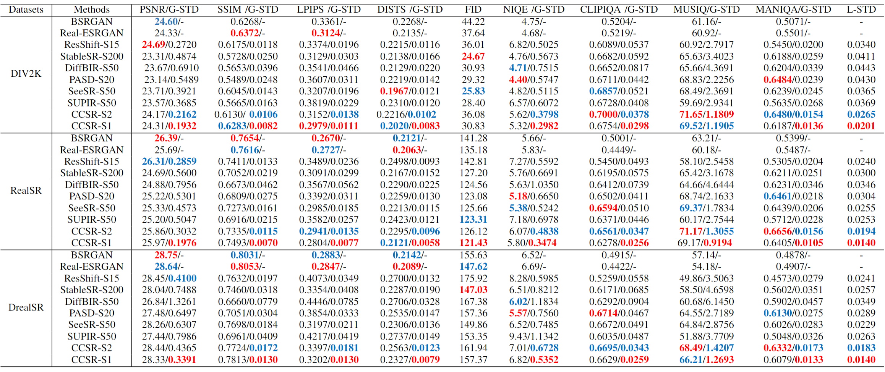

<p align="center">
    
</p>

<div align="center">
<h2>Improving the Stability and Efficiency of Diffusion Models for Content Consistent Super-Resolution</h2>


<a href='https://arxiv.org/pdf/2401.00877'></a> 


[Lingchen Sun](https://scholar.google.com/citations?hl=zh-CN&tzom=-480&user=ZCDjTn8AAAAJ)<sup>1,2</sup>
| [Rongyuan Wu](https://scholar.google.com/citations?user=A-U8zE8AAAAJ&hl=zh-CN)<sup>1,2</sup> | 
[Jie Liang](https://scholar.google.com.sg/citations?user=REWxLZsAAAAJ&hl)<sup>2</sup> |
[Zhengqiang Zhang](https://scholar.google.com/citations?hl=zh-CN&user=UX26wSMAAAAJ&view_op=list_works&sortby=pubdate)<sup>1,2</sup> | 
[Hongwei Yong](https://scholar.google.com.hk/citations?user=Xii74qQAAAAJ&hl=zh-CN)<sup>1</sup> | 
[Lei Zhang](https://www4.comp.polyu.edu.hk/~cslzhang)<sup>1,2</sup>

<sup>1</sup>The Hong Kong Polytechnic University, <sup>2</sup>OPPO Research Institute
</div>

:star: If CCSR is helpful to your images or projects, please help star this repo. Thanks! :hugs:

 ## 🧡ྀི What's New in CCSR-v2?
We have implemented the CCSR-v2 code based on the [Diffusers](https://github.com/huggingface/diffusers). Compared to CCSR-v1, CCSR-v2 brings a host of upgrades:

- 🛠️**Step Flexibility**: Offers flexibility in diffusion step selection, **allowing users to freely adjust the number of steps to suit their specific requirements**. This adaptability **requires no additional re-training**, ensuring seamless integration into diverse workflows.
- ⚡**Efficiency**: Supports highly efficient inference with **as few as 2 or even 1 diffusion step**, drastically reducing computation time without compromising quality.
- 📈**Enhanced Clarity**: With upgraded algorithms, CCSR-v2 restores images with crisper details while maintaining fidelity.
- ⚖️**Results stability**: CCSR-v2 exhibits significantly improved stability in synthesizing fine image details, ensuring higher-quality outputs.
- 🔄**Stage 2 Refinement**: In CCSR-v2, the output $\hat{x}_{0 \gets T}$ from Stage 1 is now directly fed into Stage 2, streamlining the restoration process into an efficient one-step diffusion workflow. This strategy boosts both speed and performance.


Visual comparisons between the SR outputs with the same input low-quality image but two different noise samples by different DM-based
methods. `S` denotes diffusion sampling timesteps. Existing DM-based methods, including StableSR, PASD, SeeSR, SUPIR and AddSR, **show noticeable instability with the different noise samples**. OSEDiff directly takes low-quality image as input without
noise sampling. It is deterministic and stable, but **cannot perform multi-step diffusion** for high generative capacity. In contrast, **our proposed CCSR method
is flexible for both multi-step diffusion and single-step diffusion, while producing stable results with high fidelity and visual quality**.

## ⏰ Update
- **2024.12.12**: Code and models for CCSR-v2 are released. 👀 Please refer to this [branch](https://github.com/csslc/CCSR/tree/CCSR-v2.0).
- **2024.9.25**: ⭐[CCSR-v2](https://arxiv.org/pdf/2401.00877) is released, offering reduced step requirements and supporting flexible diffusion step selection (2 or even 1 step) during the inference stage without the need for re-training.
- **2023.12.23**: Code and models for [CCSR-v1](https://arxiv.org/pdf/2401.00877v1) are released. Please refer to this [branch](https://github.com/csslc/CCSR/tree/CCSR-v1.0).


## 🌟 Overview Framework


## 😍 Visual Results
### Demo on Real-world SR

[](https://imgsli.com/MzI2MTg5) [](https://imgsli.com/MzI2MTky/1/3) [](https://imgsli.com/MzI2MTk0/0/2) [](https://imgsli.com/MzI2MTk1/0/2) 





For more comparisons, please refer to our paper for details.

## 📝 Quantitative comparisons
We propose new stability metrics, namely global standard deviation (G-STD) and local standard deviation (L-STD), to respectively measure the image-level and pixel-level variations of the SR results of diffusion-based methods.

More details about G-STD and L-STD can be found in our paper.


## ⚙ Dependencies and Installation
```shell
## git clone this repository
git clone https://github.com/csslc/CCSR.git
cd CCSR


# create an environment with python >= 3.9
conda create -n ccsr python=3.9
conda activate ccsr
pip install -r requirements.txt
```
## 🍭 Quick Inference
**For ease of comparison, we have provided the test results of CCSR-v2 on the DIV2K, RealSR, and DrealSR benchmarks with varying diffusion steps, which can be accessed via [Google Drive](https://drive.google.com/drive/folders/1xjURQZgKAlENzMnAJA2PDG9h_UxfZzio?usp=sharing).**

#### Step 1: Download the pretrained models
- Download the pretrained SD-2.1-base models from [HuggingFace](https://huggingface.co/stabilityai/stable-diffusion-2-1-base).
- Download the CCSR-v2 models from and put the models in the `preset/models`:

| Model Name             | Description                      | GoogleDrive                                                                                                                                                        | BaiduNetdisk                                                                                                                 |
|:-----------------------|:---------------------------------|:-------------------------------------------------------------------------------------------------------------------------------------------------------------------|:-----------------------------------------------------------------------------------------------------------------------------|
| Controlnet             | Trained in the stage 1.          | [download](https://drive.google.com/drive/folders/1aHwgodKwKYZJBKs0QlFzanSjMDhrNyRA?usp=sharing)                                                                   | [download](https://pan.baidu.com/s/1SKS70iE4GhhHGxqY1KS8mw) (pwd: ccsr)                                                      |
| VAE                    | Trained in the stage 2.          | [download](https://drive.google.com/drive/folders/1yHfMV81Md6db4StHTP5MC-eSeLFeBKm8?usp=sharing)                                                                   | [download](https://pan.baidu.com/s/1fxOIeL6Hk6Muq9h8itAIKQ) (pwd: ccsr)                                                      |
| Pre-trained Controlnet | The pre-trained model of stage1. | [download](https://drive.google.com/drive/folders/1LTtBRuObITOJwbW-sTDnHtp8xIUZFDHh?usp=sharing)                                                                   | [download](https://pan.baidu.com/s/1mDeuHBqNj_Iol7PCY_Xfww) (pwd: ccsr)                                                      |
| Dino models            | The pre-trained models for disc. | [download](https://drive.google.com/drive/folders/1PcuZGUTJlltdPz2yk2ZIa4GCtb1yk_y6?usp=sharing)                                                                   | [download](https://pan.baidu.com/s/1nPdNwgua91mDDRApWUm39Q) (pwd: ccsr)                                                      |

#### Step 2: Prepare testing data
You can put the testing images in the `preset/test_datasets`.

#### Step 3: Running testing command 
For one-step diffusion process:
```
python test_ccsr_tile.py \
--pretrained_model_path preset/models/stable-diffusion-2-1-base \
--controlnet_model_path preset/models \
--vae_model_path preset/models \
--baseline_name ccsr-v2 \
--image_path preset/test_datasets \
--output_dir experiments/test \
--sample_method ddpm \
--num_inference_steps 1 \
--t_min 0.0 \
--start_point lr \
--start_steps 999 \
--process_size 512 \
--guidance_scale 1.0 \
--sample_times 1 \
--use_vae_encode_condition \
--upscale 4
```
For multi-step diffusion process:
```
python test_ccsr_tile.py \
--pretrained_model_path preset/models/stable-diffusion-2-1-base \
--controlnet_model_path preset/models \
--vae_model_path preset/models \
--baseline_name ccsr-v2 \
--image_path preset/test_datasets \
--output_dir experiments/test \
--sample_method ddpm \
--num_inference_steps 6 \
--t_max 0.6667 \
--t_min 0.5 \
--start_point lr \
--start_steps 999 \
--process_size 512 \
--guidance_scale 4.5 \
--sample_times 1 \
--use_vae_encode_condition \
--upscale 4
```
We integrate [tile_diffusion](https://github.com/albarji/mixture-of-diffusers) and [tile_vae](https://github.com/pkuliyi2015/multidiffusion-upscaler-for-automatic1111/tree/main) to the [inference_ccsr_tile.py](inference_ccsr_tile.py) to save the GPU memory for inference.
You can change the tile size and stride according to the VRAM of your device.
```
python test_ccsr_tile.py \
--pretrained_model_path preset/models/stable-diffusion-2-1-base \
--controlnet_model_path preset/models \
--vae_model_path preset/models \
--baseline_name ccsr-v2 \
--image_path preset/test_datasets \
--output_dir experiments/test \
--sample_method ddpm \
--num_inference_steps 6 \
--t_max 0.6667 \
--t_min 0.5 \
--start_point lr \
--start_steps 999 \
--process_size 512 \
--guidance_scale 4.5 \
--sample_times 1 \
--use_vae_encode_condition \
--upscale 4 \
--tile_diffusion \
--tile_diffusion_size 512 \
--tile_diffusion_stride 256 \
--tile_vae \
--vae_decoder_tile_size 224 \
--vae_encoder_tile_size 1024 \
```

You can obtain `N` different SR results by setting `sample_times` as `N` to test the stability of CCSR. The data folder should be like this:

```
 experiments/test
 ├── sample00   # the first group of SR results 
 └── sample01   # the second group of SR results 
   ...
 └── sampleN   # the N-th group of SR results 
```

## 📏 Evaluation
1. Calculate the Image Quality Assessment for each restored group.

   Fill in the required information in [cal_iqa.py](cal_iqa/cal_iqa.py) and run, then you can obtain the evaluation results in the folder like this:
   ```
    log_path
    ├── log_name_npy  # save the IQA values of each restored group as the npy files
    └── log_name.log   # log recode
   ```

2. Calculate the G-STD value for the diffusion-based SR method.

   Fill in the required information in [iqa_G-STD.py](cal_iqa/iqa_G-STD.py) and run, then you can obtain the mean IQA values of N restored groups and G-STD value.

3. Calculate the L-STD value for the diffusion-based SR method.

   Fill in the required information in [iqa_L-STD.py](cal_iqa/iqa_L-STD.py) and run, then you can obtain the L-STD value.


## 🚋 Train 

#### Step1: Prepare training data
  Generate txt file for the training set.
  Fill in the required information in [get_path](scripts/get_path.py) and run, then you can obtain the txt file recording the paths of ground-truth images. 
  You can save the txt file into `preset/gt_path.txt`.

#### Step2: Train Stage1 Model
1. Download pretrained [Stable Diffusion v2.1](https://huggingface.co/stabilityai/stable-diffusion-2-1-base) to provide generative capabilities.

    ```shell
    wget https://huggingface.co/stabilityai/stable-diffusion-2-1-base/resolve/main/v2-1_512-ema-pruned.ckpt --no-check-certificate
    ```

2. Start training.

    ```shell
   CUDA_VISIBLE_DEVICES="0,1,2,3," accelerate launch train_ccsr_stage1.py \
    --pretrained_model_name_or_path="preset/models/stable-diffusion-2-1-base" \
    --controlnet_model_name_or_path='preset/models/pretrained_controlnet' \
    --enable_xformers_memory_efficient_attention \
    --output_dir="./experiments/ccsrv2_stage1" \
    --mixed_precision="fp16" \
    --resolution=512 \
    --learning_rate=5e-5 \
    --train_batch_size=4 \
    --gradient_accumulation_steps=6 \
    --dataloader_num_workers=0 \
    --checkpointing_steps=500 \
    --t_max=0.6667 \
    --max_train_steps=20000 \
    --dataset_root_folders 'preset/gt_path.txt' 
    ```

#### Step3: Train Stage2 Model
1. Put the model obtained from the stage1 into `controlnet_model_name_or_path`.
2. Start training.
    ```shell
    CUDA_VISIBLE_DEVICES="0,1,2,3," accelerate launch train_ccsr_stage2.py \
    --pretrained_model_name_or_path="preset/models/stable-diffusion-2-1-base" \
    --controlnet_model_name_or_path='preset/models/model_stage1' \
    --enable_xformers_memory_efficient_attention \
    --output_dir="./experiments/ccsrv2_stage2" \
    --mixed_precision="fp16" \
    --resolution=512 \
    --learning_rate=5e-6 \
    --train_batch_size=2 \
    --gradient_accumulation_steps=8 \
    --checkpointing_steps=500 \
    --is_start_lr=True \
    --t_max=0.6667 \
    --num_inference_steps=1 \
    --is_module \
    --lambda_l2=1.0 \
    --lambda_lpips=1.0 \
    --lambda_disc=0.05 \
    --lambda_disc_train=0.5 \
    --begin_disc=100 \
    --max_train_steps=2000 \
    --dataset_root_folders 'preset/gt_path.txt'  
      ```
    
    
    
    

### Citations

If our code helps your research or work, please consider citing our paper.
The following are BibTeX references:

```
@article{sun2023ccsr,
  title={Improving the Stability of Diffusion Models for Content Consistent Super-Resolution},
  author={Sun, Lingchen and Wu, Rongyuan and Zhang, Zhengqiang and Yong, Hongwei and Zhang, Lei},
  journal={arXiv preprint arXiv:2401.00877},
  year={2024}
}
```

### License
This project is released under the [Apache 2.0 license](LICENSE).

### Acknowledgement
This project is based on [ControlNet](https://github.com/lllyasviel/ControlNet), [BasicSR](https://github.com/XPixelGroup/BasicSR) and [SeeSR](https://github.com/cswry/SeeSR). Some codes are brought from [ADDSR](https://github.com/NJU-PCALab/AddSR). Thanks for their awesome works. 

### Contact
If you have any questions, please contact: ling-chen.sun@connect.polyu.hk


<details>
<summary>statistics</summary>


</details>


